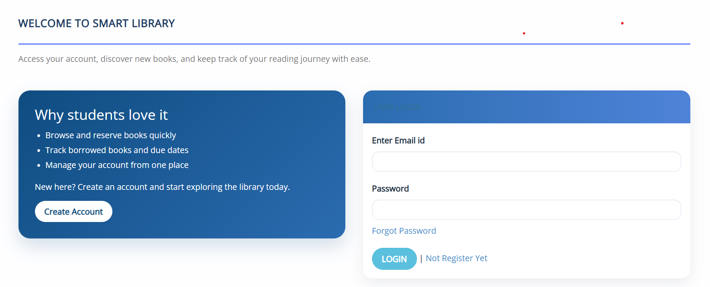
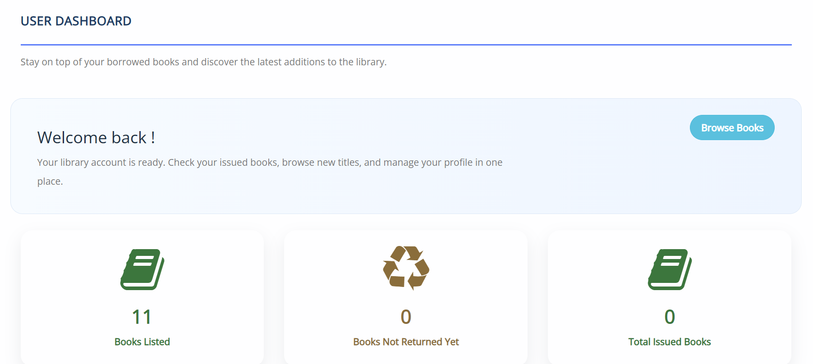

<h1 align="center">📚 Library Management System</h1>

<p align="center">
A Modern Library Management Web Application Built with PHP & MySQL
</p>

<p align="center">
Book Management • Member Management • CRUD Operations • Authentication • Responsive UI
</p>

---

## 📖 Overview

The **Library Management System** is a web-based application developed using **PHP** and **MySQL** to streamline and simplify day-to-day library operations. The application enables librarians to efficiently manage books, members, book issuance, and returns through an intuitive and user-friendly interface.

Built using core web technologies, this project demonstrates practical implementation of database connectivity, CRUD operations, user authentication, and backend development concepts while ensuring efficient library administration.

---

## ✨ Features

- 🔐 Secure user authentication
- 📚 Add, update, delete, and manage books
- 👥 Member management
- 📖 Book issue and return system
- 🔍 Search books and members
- 💾 MySQL database integration
- 📱 Responsive and user-friendly interface
- ⚡ Efficient CRUD operations

---

## 🛠️ Tech Stack

| Technology | Purpose |
|------------|---------|
| PHP | Backend Development |
| MySQL | Database Management |
| HTML5 | Page Structure |
| CSS3 | Styling |
| JavaScript | Client-side Interactivity |
| XAMPP | Local Development Environment |

---

## 📂 Project Structure

```text
Library-Management-System/
│
├── css/
├── js/
├── images/
├── database/
├── *.php
├── library_management.sql
└── README.md
```

---

## 📸 Preview

### Login Page



### Dashboard



### Books Management


---

## ⚙️ Installation

Clone the repository

```bash
git clone https://github.com/Pradhiba-05/Library-Management-System
```

Navigate to the project directory

```bash
cd Library-Management-System
```

Move the project folder into:

```text
xampp/htdocs/
```

Start the following services from **XAMPP Control Panel**

- Apache
- MySQL

Open **phpMyAdmin**

```text
http://localhost/phpmyadmin
```

Create a database

```text
library_management
```

Import

```text
library_management.sql
```

Launch the application

```text
http://localhost/Library-Management-System/
```

---

## 🗄️ Database

| Database | Description |
|----------|-------------|
| library_management | Stores books, members, login credentials, issued books, and return records. |

---

## 🔮 Future Enhancements

- Barcode Integration
- Email Notifications
- Fine Calculation System
- Book Reservation
- Role-Based User Access
- Dashboard Analytics
- Cloud Database Support

---

## 📄 License

This project was developed for educational purposes and to demonstrate backend web development using PHP and MySQL.

---

<div align="center">

### ✨ Thank you for visiting!

Designed & Developed with ❤️ by **Pradhiba S**

</div>